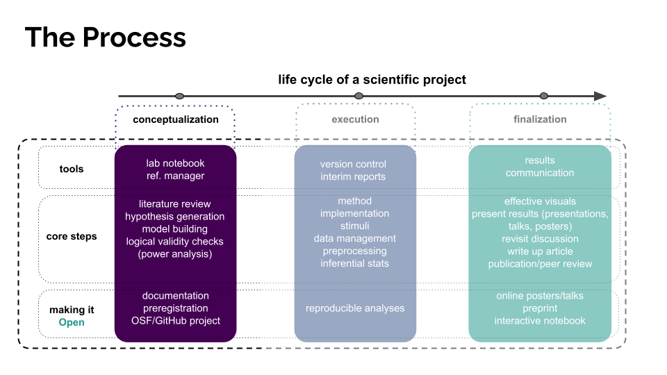

# Conceptualization

`Module I`

The planning and conceptualization phase of an experiment is perhaps the most important part of running an experiment. 
It's where you formalize all the components you'll need to actually implement and [execute](https://avakiai.com/expra_winter2021-2022/experimentation/execution.html) the experiment. 

Recall this basic guide we went over in class:

Below are some of the key components that we went over:

### Lab Book

Our Lab Book (see Slack) housed our main ideas regarding manipulations, design, analysis, stimuli, texts to be presented to the participants, and so on.

### Literature Review

We used Zotero to organize our literature review.

## Power Analysis

A brief [power analysis](https://github.com/avakiai/expra_winter2021-2022/blob/master/course_book/experimentation/power_analysis.R) helped us get a sense of how many participants we'd need, so that we don't rely on poor rules of thumb such as "20 participants per condition."

## OSF Project

In anticipation of making our data, experiment, analysis, and conclusions replicable and transparent, we set up an [OSF project page](https://osf.io/gywj9/) for our experiment.

## Preregistration

We then wrote up a preregistration ([posted to OSF](https://osf.io/x56np/) before data analysis began) in which we formalized our intuitions into hypotheses, wrote down our planned analyses, and outlined our data collection protocol.

Once we completed the above, we moved on to the implementation and execution of the experiment... 
