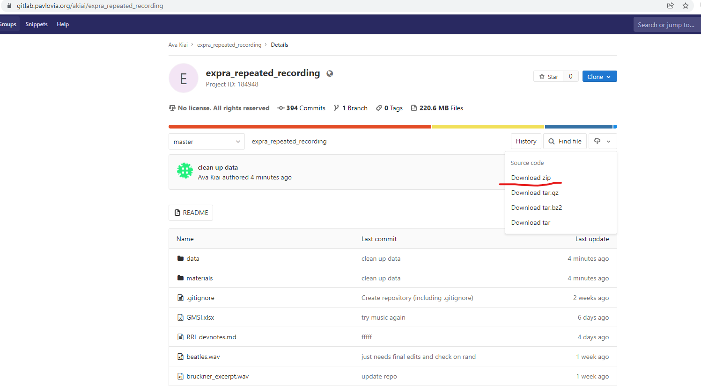

# Execution

`Module II`

In the execution phase of our study, we worked on getting the experiment implemented (i.e. gathering and polishing our stimuli, writing our experiment code, getting ready to collect data from participants).


### Implementation

We built our experiment using PsychoPy (written in Python & PsychoJS, a JavaScript library), which we rendered fully online using Pavlovia (a server for PsychoPy experiments). Thus, the scripts that run our experiment, all experiment components, and all raw data live in a single repository, the [Repeated Recording Illusion/Pavlovia GitLab Repository](https://gitlab.pavlovia.org/akiai/expra_repeated_recording) (hereafter, the `Pavlovia` respository).


### Stimuli

The stimuli we used for our experiment featured a song by the Beatles and a symphony by Anton Bruckner. The raw files we obtained as .mp4 files. However, the stimuli had to undergo some processing before we could use it. 

The stimuli can be found in the project `Pavlovia` repository under `materials/stimuli`. 

The original files (`/originals`) were converted to formats readable by the free software Praat (`/converted`). We then saved the clipped files (i.e. Beatles in full, Bruckner shortened to contain only last 2 mins 48 sec.) to their own `clipped` folder. Finally, we equalized the intensity to 71 dB SPL on both recordings as well as set both to the same sampling rate, 44100 (`final`).

```{admonition} Note
:class: note

This page will be frequently updated. It will soon contain more links and information to help clarify some of the references to software, etc. Let your instructor know if you want anything in particular better explained!

```


### Analysis

While the above-mentioned Pavlovia repository holds our raw data, we want a separate repository where we house our analysis scripts, and where we can save our "wrangled data" (if necessary), as well as figures, tables, and knitted .Rmd reports. 

We created such a repository on GitHub for the project: [Repated Recording Illusion/Analysis GitHub Repository](https://github.com/avakiai/expra_repeated_recording_illusion) (hereafter, `analysis` repository).

In this repository we will store the analysis for our data preprocessing, inferential stats, figures, etc. Since we will use R Markdown (.Rmd) files that will be publicly available, anyone should be able to follow our Data Management procedure to generate the same results. 


### Data Management

Alright, so now that we have all the components at hand, let's get them on our local computers: 

1. To download the raw data from the `Pavlovia` repository, navigate to the main page of that repository, click on the little cloud icon and download the whole repository as a zip file. Export it to somewhere convenient. 

2. Important! For ease of reference, rename the folder `RRI_data_materials`. (This is how we will refer to it in later scripts.)



3. To download our `analysis` repository, navigate to that repository, click on `Code` and download the whole repository as a zip file. **Be sure to export this folder to the same folder as you saved the data repository.** 

4. Rename this folder `RRI_analysis`.


Now, your folder structure should look something like this:

EXPRA/

|--- RRI_data_materials/ (<-- Here is where the `Pavlovia` repository lives.)

|--- RRI_analysis/ (<-- Here is where the `analysis` repository lives.)

```{warning} Keep Your Data Folder Up To Date!

Since we are beginning the process of analysis while data collection is still underway, you will need to download new data. To do this, the simplest way would be to go to the `Pavlovia` repository and re-download *only* the **RRI_data_materials/data** folder. You can replace your old /data folder with the new one. 

````


```{admonition} Get Fresh, Annotated Analysis As They Become Available!

As we work through analyses, I may update the scripts we use (sometimes with bug fixes, othertimes with solutions to coding problems). If you get a ping on Slack that a new script or new helper functions have been added, navigate to the `analysis` repository. 

Helper Functions: The `analysis/funs.R` file, which contains helper functions, can just be replaced with the new one.

Scripts: New components or chunks added to analysis files can be incorporated into your scripts however you prefer. Make sure to clean up your workspace by deleteing any old or unused files and use consistent file naming protocols if you would like to keep multiple versions of a file. For example:

analysis_v1.Rmd

analysis_v2.Rmd

analysis_v3.Rmd

````


### Data Check

Since our experiment features a between-subjects design, we implemented a feature in our experiment code that assigns participant to different groups based on the participant number and a randomly shuffled vector later in the experiment. This means an imbalance in participant distribution between conditions can occur. So, without looking at the data itself (i.e. the dependent variables), we can perform a quick check to make sure our data look ok:

To progress of our data collection and condition randomization, we use the file `RRI_data_materials/materials/check_participation_progress.Rmd`. 

Along with a helper function in the adjacent .R file, this script allows us to calculate the number of complete data sets (and the participanat numbers), and which of those were assigned to the Working Memory condition (0 (no) or 1 (yes)), which saw which musical genre first (classical, rock or rock, classical), and which were presented with which order of explicit information or prestige suggestion (baseline, low, high vs. baseline, high, low).


