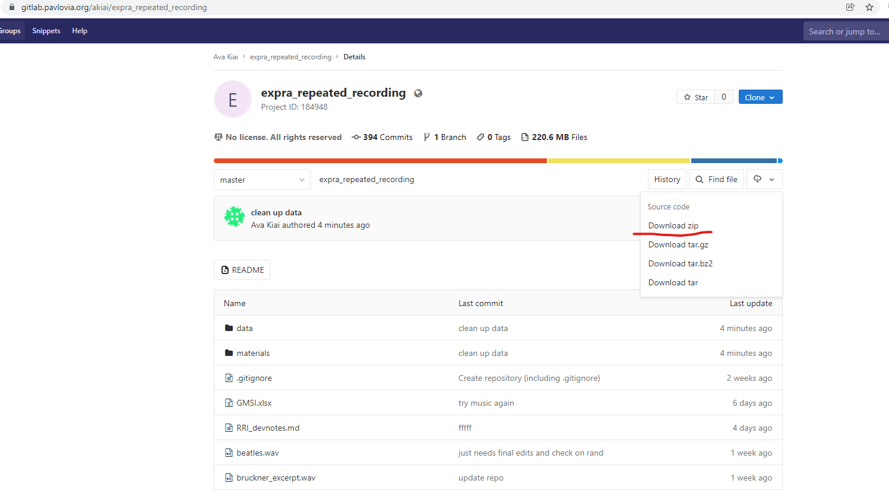

# Experimentation


[Pavlovia GitLab Repository](https://gitlab.pavlovia.org/akiai/expra_repeated_recording): where experiment scripts, stimuli, and raw data live.

[Repated Recording Illusion GitHub Repository](https://github.com/avakiai/expra_repeated_recording_illusion): where our analses, processed data, and related materials live.

## Stimuli & Implementation

The stimuli can be found in the project GitLab repository under `materials/stimuli`. The original files (`/originals`) were converted to formats readable by the free software Praat (`/converted`). We then saved the clipped files (i.e. Beatles in full, Bruckner shortened to contain only last 2 mins 48 sec.) to their own `clipped` folder. Finally, we equalized the intensity to 71 dB SPL on both recordings as well as set both to the same sampling rate, 44100 (`final`).

The experiment was programmed in PsychoPy and is written in Python & JavaScript (rather, PsychoJS - a JS library designed for psychology). 

```{admonition} Note
:class: note

This page will be frequently updated. It will soon contain more links and information to help clarify some of the references to software, etc. Let your instructor know if you want anything in particular better explained!

```

## Data Management

To download the raw data (Pavlovia) repository, click on the little cloud icon and download the whole repository as a zip file and export it to somewhere convenient. 



````{margin}
```{warning} 
Since we are beginning the process of analysis while data collection is still underway, you will need to download new data. To do this, the simplest way would be to delete *only* the **expra_repeated_recording/data** folder from your folders, and to download that folder anew from the data repository. 

````

To download our working (GitHub) repository, click on `Code` and download as a zip file. **Be sure to export this folder to the same folder as you saved the data repository.**

So, your folder structure should look something like this:

EXPRA/

| 

| expra_repeated_recording/

| expra_RRI/


## Preprocessing

We will first check on the progress of our data collection and condition randomization using the file `expra_repeated_recording/materials/randomize_wm_task.R`. 

We will then wrangle and begin analysis with the file `expra_RRI/analysis/RRI_Analysis_1.Rmd`