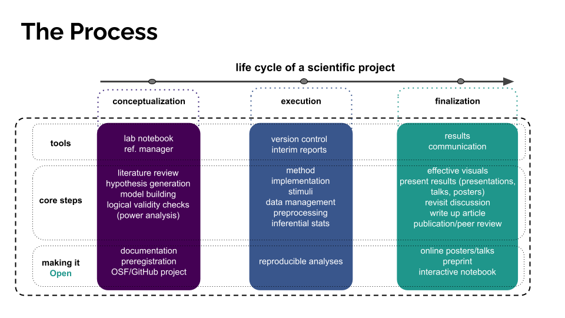

# Finalization

`Module III`

In the final stage of a study, we'll generate our results by systematically stepping through our analysis plan, focus on polishing our figures to be maximally effective, revisit our hypothesis and infer some conclusions from our results, and get our study into a form ready for others to consume (whether as a poster, presentation, or written document). We'll also wrap up our study by linking our `analysis` repository and `Pavlovia` repository to our OSF project, and posting a version 
of our report and/or poster to the same.

### Analysis

We'll divide up our analyses into four parts, which we'll tackle and finalize in the few weeks of `Module III`.

#### Analysis I: Modelling, Part I

Hypothesis 3: Did WM load and explicit information affect liking (rating scores)? 

Method: Linear model on z-scored ratings.

#### Analysis II: Modelling, Part II

Hypothesis 3: Did WM load and explicit information affect liking (rating scores)?

Method: Linear model on aggregate scores/PCA.

#### Analysis III: Classification

Hypothesis 1 & 2: Did WM load, explicit information manipulate rates at which people fell for the illusion?

Method: Analyze Open-Text Boxes and classify participants into fell/did not fall for the illusion. Logistic modelling of classification.

#### Analysis IV: Individual Differences & Bring it all together

Exploratory Hypotheses: Evaluate role of musical experience in modulating illusion effect.

Method: Aggregate GSI ratings. Model rate of falling for the illusion, ratings based on musical expertise.

### Data Visualization

Coming soon!

### Preparing a Poster

Coming soon!

### Preparing your Report

Coming soon!